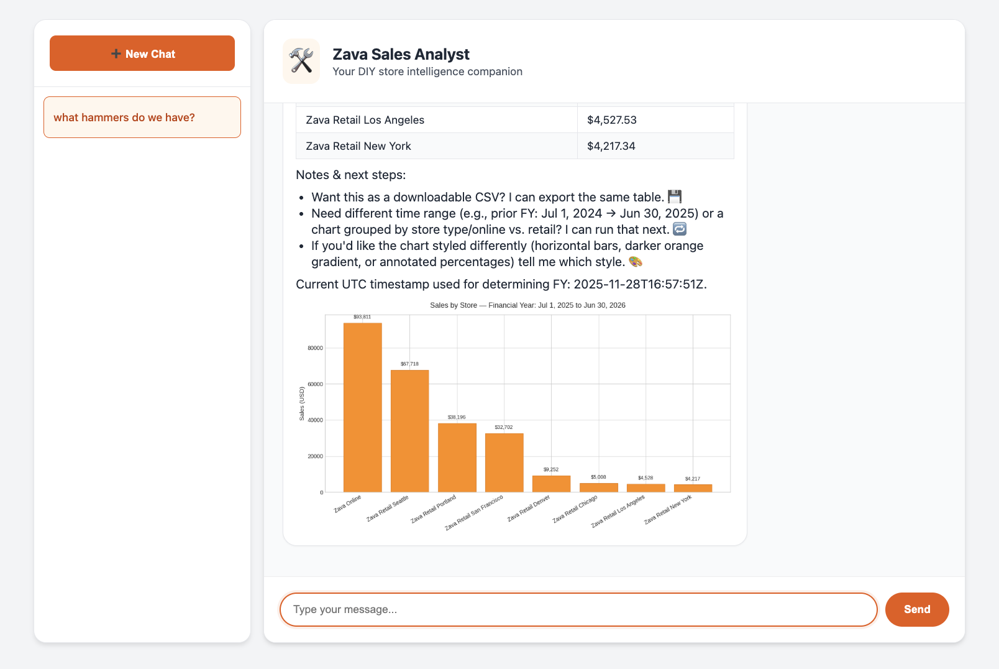

<!-- YAML front-matter schema: https://review.learn.microsoft.com/en-us/help/contribute/samples/process/onboarding?branch=main#supported-metadata-fields-for-readmemd -->

# LangChain Agent with Model Context Protocol (MCP)



[](https://codespaces.new/Azure-Samples/langchain-agent-python)

This sample demonstrates a **production-ready LangChain agent** that uses the **OpenAI Responses API** with **Model Context Protocol (MCP)** for tool integration. The agent uses **Azure OpenAI GPT-5-mini** with **Entra ID authentication**, **PostgreSQL with pgvector** for semantic search, and is deployed as microservices on **Azure Container Apps**.

This is a simplified, Python version inspired by the [Microsoft AI Tour WRK540 workshop](https://github.com/microsoft/aitour26-WRK540-unlock-your-agents-potential-with-model-context-protocol), but uses the same product data and instructions.

## Features

**LangChain with Responses API** - Uses OpenAI's latest Responses API for native MCP tool support  
**Azure OpenAI GPT-5-mini** - Latest reasoning model deployed via Azure  
**PostgreSQL with pgvector** - Semantic search over product catalog using vector embeddings  
**Entra ID Authentication** - Keyless authentication using Managed Identity (no API keys)  
**MCP Server** - FastMCP server with database and semantic search tools  
**Microservices Architecture** - Agent and MCP server deployed as independent container apps  
**Infrastructure as Code** - Complete Bicep templates with Azure best practices  
**One-command Deployment** - Deploy everything with `azd up`

## Architecture

```
┌─────────────────────────────────────────────────────────────┐
│                        Azure Cloud                          │
│                                                             │
│  ┌──────────────────────────────────────────────────────┐  │
│  │         Azure Container Apps Environment             │  │
│  │                                                        │  │
│  │  ┌─────────────────┐      ┌──────────────────┐      │  │
│  │  │  Agent Container │──────│  MCP Server      │      │  │
│  │  │  - LangChain     │ HTTP │  - PostgreSQL    │      │  │
│  │  │  - Responses API │◄─────│  - Semantic      │      │  │
│  │  │                  │      │    Search       │      │  │
│  │  └─────────┬────────┘      └────────┬─────────┘      │  │
│  │            │                         │                 │  │
│  └────────────┼─────────────────────────┼─────────────────┘  │
│               │ Entra ID                │                    │
│               ▼                         ▼                    │
│  ┌─────────────────────────┐  ┌──────────────────────┐     │
│  │   Azure OpenAI          │  │  PostgreSQL          │     │
│  │   - GPT-5-mini          │  │  - pgvector          │     │
│  │   - text-embedding-     │  │  - Zava database     │     │
│  │     3-small             │  │                      │     │
│  └─────────────────────────┘  └──────────────────────┘     │
└─────────────────────────────────────────────────────────────┘

Local Development:
┌──────────────┐      ┌──────────────┐      ┌──────────────┐
│ agent.py     │─HTTP─│ MCP Server   │      │ Azure OpenAI │
│ (localhost)  │◄─────│ (localhost:  │─────▶│ (cloud)      │
│              │      │  8000)       │ Entra│              │
└──────────────┘      └──────────────┘  ID  └──────────────┘
```

## Prerequisites

### Cloud Deployment

- **Azure Subscription** - [Create one for free](https://azure.microsoft.com/free/)
- **Azure Developer CLI (azd)** - [Install azd](https://learn.microsoft.com/azure/developer/azure-developer-cli/install-azd)
- **Azure CLI** - [Install Azure CLI](https://learn.microsoft.com/cli/azure/install-azure-cli)

### Local Development

- **Python 3.11+** - [Download Python](https://www.python.org/downloads/)
- **Docker Desktop** - [Install Docker](https://www.docker.com/products/docker-desktop)

### Quick Start (Recommended)

- **GitHub Codespaces** - Click the badge above to start in a pre-configured environment with all tools installed!

## Quick Start

### Deploy to Azure (5 minutes)

```bash
# 1. Login to Azure
az login
azd auth login

# 2. Deploy everything
azd up
```

That's it! The `azd up` command will:

- Provision Azure OpenAI with GPT-5-mini
- Create Container Apps environment
- Build and deploy both the agent and MCP server containers
- Configure networking and managed identity
- Set up monitoring with Application Insights

After deployment completes, you'll see output like:

```
SUCCESS: Your application was provisioned and deployed to Azure!

Endpoints:
  - MCP Server: https://ca-mcp-abc123.region.azurecontainerapps.io
  - Agent: https://ca-agent-abc123.region.azurecontainerapps.io
```

### Local Development

**Option 1: Use Azure Database (Recommended)**

```bash
# 1. Deploy to Azure first
azd up

# 2. Get configuration and set MCP server URL
azd env get-values > .env.local
echo "MCP_SERVER_URL=http://localhost:8000" >> .env.local

# 3. Start MCP server (Terminal 1)
cd mcp
source ../.env.local
python app.py

# 4. Start agent server (Terminal 2)
cd agent
source ../.env.local
PORT=8001 python app.py

# 5. Open browser to http://localhost:8001
```

**Option 2: Full Local Stack**

```bash
# 1. Start PostgreSQL with pgvector
docker-compose up -d

# 2. Configure environment
cp .env.example .env.local
# Edit .env.local with your Azure OpenAI credentials

# 3. Initialize database
cd data
source ../.env.local
python generate_database.py

# 4. Regenerate embeddings (required if your Azure OpenAI uses a different embedding model)
python regenerate_embeddings.py

# 5. Start MCP server (Terminal 1)
cd mcp
source ../.env.local
python app.py

# 6. Start agent server (Terminal 2)
cd agent
source ../.env.local
PORT=8001 python app.py

# 7. Open browser to http://localhost:8001
```

**VS Code Tasks:**

The project includes pre-configured VS Code tasks. Press `Cmd+Shift+P` (Mac) or `Ctrl+Shift+P` (Windows/Linux) and select "Tasks: Run Task" to see available tasks:
- Start MCP Server
- Start Agent
- Start PostgreSQL (Docker)
- Initialize Database

**Ports:**

- MCP Server: `8000`
- Agent/Chat UI: `8001` (set via `PORT` environment variable)

## Project Structure

```
langchain-agent-python/
├── azure.yaml                      # Azure Developer CLI configuration
├── README.md                       # This file
├── LICENSE                         # MIT License
├── SECURITY.md                     # Security policy
├── SUPPORT.md                      # Support information
├── CODE_OF_CONDUCT.md             # Code of conduct
├── .env.example                    # Template for environment variables
├── .gitignore                      # Git ignore rules
│
├── agent/                          # LangChain Agent Service
│   ├── agent.py                    # Main agent with Responses API
│   ├── config.py                   # Pydantic configuration
│   ├── instructions.txt            # System prompt for agent
│   ├── requirements.txt            # Python dependencies
│   ├── Dockerfile                  # Container definition
│   └── .dockerignore              # Docker ignore rules
│
├── mcp/                            # MCP Server Service
│   ├── mcp_server.py              # FastMCP server with tools
│   ├── requirements.txt            # Python dependencies
│   ├── Dockerfile                  # Container definition
│   └── .dockerignore              # Docker ignore rules
│
└── infra/                          # Infrastructure as Code
    ├── main.bicep                  # Main deployment template
    ├── main.parameters.json        # Default parameters
    ├── abbreviations.json          # Resource name abbreviations
    ├── core/                       # Reusable Bicep modules
    │   ├── ai/
    │   │   └── cognitiveservices.bicep
    │   ├── host/
    │   │   ├── container-apps-environment.bicep
    │   │   └── container-registry.bicep
    │   ├── monitor/
    │   │   └── monitoring.bicep
    │   └── security/
    │       ├── managed-identity.bicep
    │       └── role.bicep
    └── app/                        # Application-specific modules
        ├── agent.bicep
        └── mcp-server.bicep
```

## How It Works

### 1. **Agent (LangChain + Responses API)**

The agent uses LangChain's `ChatOpenAI` with the new **Responses API** for native MCP tool support:

```python
from langchain_openai import ChatOpenAI

llm = ChatOpenAI(
    model="gpt-5-mini",
    base_url=f"{endpoint}/openai/v1/",
    api_key=token_provider,
    model_kwargs={"use_responses_api": True}
)

# Bind MCP tools from server
mcp_tools = get_mcp_tools(mcp_server_url)
llm = llm.bind_tools(mcp_tools)
```

### 2. **MCP Server (FastMCP)**

The MCP server exposes tools via FastMCP:

```python
from fastmcp import FastMCP

mcp = FastMCP("Data Analysis Tools")

@mcp.tool()
def execute_query(query: str) -> dict:
    """Execute SQL query on database."""
    # ... implementation
```

### 3. **Environment-based Configuration**

Both services use environment-aware configuration:

- **Local**: Uses `.env.local` file, connects to `localhost:8000` for MCP
- **Production**: Uses environment variables from Container Apps, connects via HTTPS to cloud MCP server

### 4. **Secure Authentication**

- **Azure OpenAI**: Uses Managed Identity (Entra ID) - no API keys
- **MCP Server**: Internal Container Apps networking
- **Monitoring**: Application Insights for observability

## Available MCP Tools

The MCP server provides these tools to the agent:

1. **`get_current_utc_date()`** - Returns current UTC timestamp for time-sensitive queries
2. **`get_table_schemas()`** - Returns PostgreSQL database schema information
3. **`execute_sales_query(query: str)`** - Executes SQL queries on PostgreSQL database
4. **`semantic_search_products(query_description: str)`** - Semantic product search using pgvector

## Database

The sample uses **Azure PostgreSQL Flexible Server** with **pgvector** for semantic product search.

**Key Features:**

- 10-table retail schema (products, orders, customers, inventory, etc.)
- Vector embeddings for semantic search using Azure OpenAI
- Pre-populated Zava DIY product catalog with ~424 products
- Natural language queries like "waterproof outdoor electrical boxes"

**Data Files Included:**

This repository includes pre-generated data files in the `data/` folder, so you don't need to download anything:
- `products_pregenerated.json` - 424 products with pre-computed embeddings
- `customers_pregenerated.json` - 500 sample customers
- `orders_pregenerated.json` - 2000 sample orders

**Setup:**

- Production: Automatically provisioned during `azd up`
- Local: Run `docker-compose up -d` then `python data/generate_database.py`

## Customization

### Add New MCP Tools

Edit `mcp/mcp_server.py`:

```python
@mcp.tool()
def my_custom_tool(param: str) -> dict:
    """Description of what this tool does."""
    # Your implementation
    return {"result": "data"}
```

The tool is automatically exposed via the `/tools` endpoint in OpenAI function format.

### Change the Model

Edit `infra/main.parameters.json`:

```json
{
  "openAiModelName": {
    "value": "gpt-5-mini" // Change to gpt-4o, etc.
  }
}
```

### Modify System Instructions

Edit `agent/instructions.txt` to change the agent's behavior and personality.

## Monitoring

View logs and metrics in Azure Portal:

```bash
# Open Application Insights
azd monitor

# View container logs
az containerapp logs show --name <agent-name> --resource-group <rg-name> --follow
```

## Troubleshooting

**"Deployment quota exceeded"**  
→ Try a different region: `azd env set AZURE_LOCATION eastus2`

**"Authentication failed"**  
→ Ensure you're logged in: `az login && azd auth login`

**"GPT-5-mini not available"**  
→ Model may not be available in your region - try eastus or westus

**"Container apps failing to start"**  
→ Check logs: `azd monitor`

**"MCP tools not loading"**  
→ Ensure MCP_SERVER_URL is accessible from the agent

## Clean Up

Remove all Azure resources:

```bash
azd down
```

## Resources

- [Azure OpenAI Documentation](https://learn.microsoft.com/azure/ai-services/openai/)
- [LangChain Documentation](https://python.langchain.com/)
- [Model Context Protocol (MCP)](https://modelcontextprotocol.io/)
- [FastMCP Framework](https://github.com/jlowin/fastmcp)
- [Azure Developer CLI (azd)](https://learn.microsoft.com/azure/developer/azure-developer-cli/)
- [Original Workshop (WRK540)](https://github.com/microsoft/aitour26-WRK540-unlock-your-agents-potential-with-model-context-protocol)

## Contributing

This project welcomes contributions and suggestions. Most contributions require you to agree to a Contributor License Agreement (CLA). For details, visit https://cla.opensource.microsoft.com.

## License

This project is licensed under the MIT License - see the [LICENSE](LICENSE) file for details.

---

**Questions or feedback?** Open an issue on [GitHub](https://github.com/Azure-Samples/langchain-agent-python/issues) or see [SUPPORT.md](SUPPORT.md).
