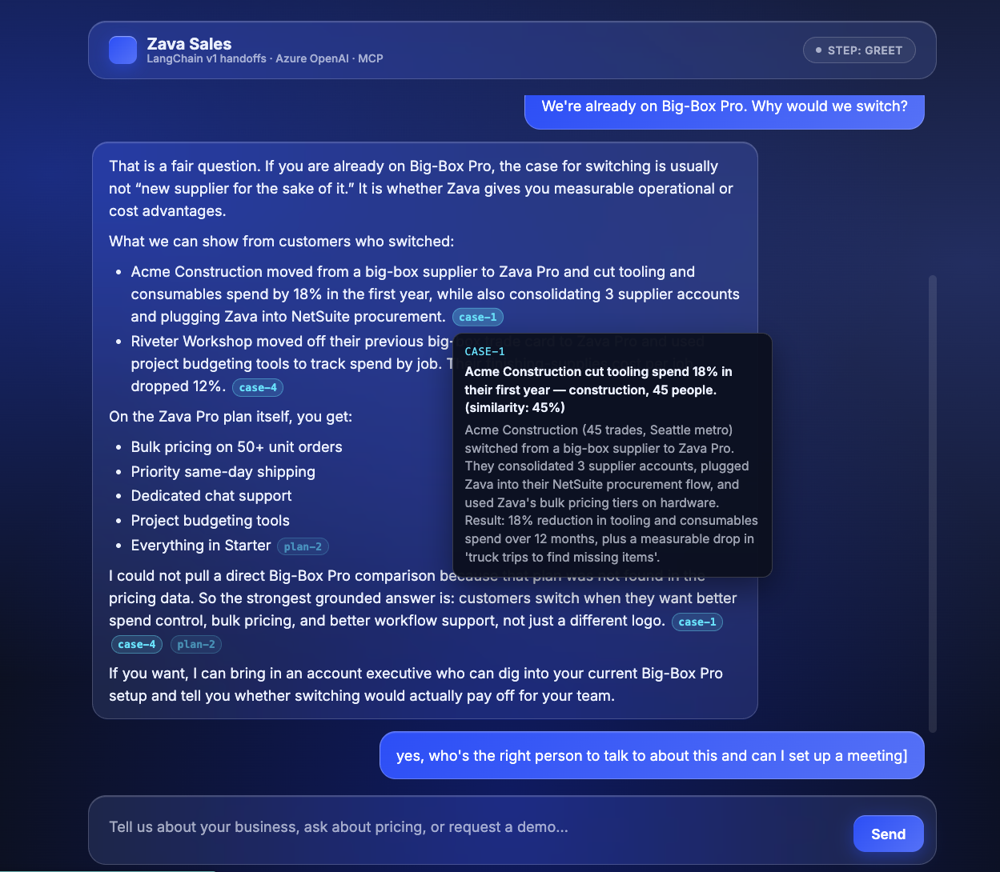

<!-- YAML front-matter schema: https://review.learn.microsoft.com/en-us/help/contribute/samples/process/onboarding?branch=main#supported-metadata-fields-for-readmemd -->

# LangChain Agent with Model Context Protocol (MCP)

A two-service Python sample that shows how to wire a [LangChain](https://python.langchain.com/) agent to a [Model Context Protocol](https://modelcontextprotocol.io/) server, run them on [Azure Container Apps](https://learn.microsoft.com/azure/container-apps/), and back them with [Azure OpenAI](https://learn.microsoft.com/azure/ai-services/openai/) and Postgres + [pgvector](https://github.com/pgvector/pgvector). Use it as a reference for building your own agent + tool-server architecture on Azure.



[](https://codespaces.new/Azure-Samples/langchain-agent-python)

## What you'll learn

- How to call the **Azure OpenAI Responses API** from LangChain, including hosted server-side tools (`code_interpreter`, `web_search_preview`).
- How to expose database operations as **MCP tools** with FastMCP and connect them to the agent over streamable HTTP.
- How to use **Entra ID (Managed Identity)** for keyless auth to Azure OpenAI and Postgres.
- How to provision the whole stack — Container Apps, Azure OpenAI, Postgres Flexible Server, monitoring — with **`azd up`**.

## Architecture

Two services, deployed independently as Container Apps:

```text
┌─────────────────────────────────────────────────────────────┐
│                        Azure Cloud                          │
│  ┌──────────────────────────────────────────────────────┐   │
│  │         Azure Container Apps Environment             │   │
│  │                                                      │   │
│  │   ┌─────────────────┐       ┌──────────────────┐     │   │
│  │   │ agent           │──HTTP─│ mcp-server       │     │   │
│  │   │  LangChain +    │       │  FastMCP +       │     │   │
│  │   │  Responses API  │◄──────│  Postgres tools  │     │   │
│  │   └────────┬────────┘       └─────────┬────────┘     │   │
│  └────────────┼─────────────────────────┼───────────────┘   │
│               │  Entra ID                │                  │
│               ▼                          ▼                  │
│   ┌────────────────────────┐  ┌──────────────────────┐      │
│   │ Azure OpenAI           │  │ Postgres Flexible    │      │
│   │  gpt-5-mini            │  │  Server + pgvector   │      │
│   │  text-embedding-       │  │  Zava retail schema  │      │
│   │   ada-002              │  │  (~424 products)     │      │
│   └────────────────────────┘  └──────────────────────┘      │
└─────────────────────────────────────────────────────────────┘
```

The agent is the only public-facing service. The MCP server is reachable only from inside the Container Apps environment.

## Prerequisites

- An Azure subscription. [Create one for free](https://azure.microsoft.com/free/).
- [Azure Developer CLI (`azd`)](https://learn.microsoft.com/azure/developer/azure-developer-cli/install-azd).
- [Azure CLI](https://learn.microsoft.com/cli/azure/install-azure-cli).
- Python 3.11+ (only required for local development).
- Docker (only required for the full local stack).

The fastest path is to open the repo in **GitHub Codespaces** — every tool above is preinstalled.

## Quick start

Deploy the whole stack to Azure with one command:

```bash
az login
azd auth login
azd up
```

`azd up` provisions Azure OpenAI (with `gpt-5-mini` and `text-embedding-ada-002`), a Postgres Flexible Server with pgvector, a Container Apps environment, and the two container images. After the build finishes a postprovision hook seeds the database with the Zava DIY catalogue (~424 products with pre-computed embeddings).

When it finishes you'll see something like:

```text
🚀 Your LangChain Agent is Ready!

🌐 Web chat:   https://ca-agent-<id>.<region>.azurecontainerapps.io/
   Health:     https://ca-agent-<id>.<region>.azurecontainerapps.io/api/health
   MCP Server: https://ca-mcp-<id>.<region>.azurecontainerapps.io/mcp
```

Open the web chat URL and try:

- *What tables are in the database?*
- *Find me 3 hammers.*
- *Show sales by store as a pie chart.*

To remove every resource later, run `azd down`.

## Repository layout

```text
.
├── agent/              # Public-facing chat service (LangChain + Responses API)
│   ├── app.py          #   Starlette app, lifespan, streaming /api/chat
│   ├── streaming.py    #   Pure parser for normalising LangChain stream chunks
│   ├── instructions.txt #  System prompt for the agent
│   └── static/         #   Single-page chat UI
├── mcp/                # Internal tool server (FastMCP)
│   └── app.py          #   4 MCP tools over Postgres + pgvector
├── data/               # Pre-generated catalogue + seed scripts
├── infra/              # Bicep templates and parameters used by `azd up`
└── azure.yaml          # azd service definitions and hooks
```

## How it works

### 1. The agent — LangChain on the Responses API

`agent/app.py` builds the agent at startup inside a Starlette `lifespan` hook so the MCP connection and OpenAI credentials are reused across requests:

```python
mcp_tools = await MultiServerMCPClient(
    {"zava-sales": {"url": MCP_SERVER_URL, "transport": "streamable_http"}}
).get_tools()

server_tools = [
    {"type": "web_search_preview"},
    {"type": "code_interpreter", "container": {"type": "auto"}},
]

model = ChatOpenAI(
    model=OPENAI_DEPLOYMENT,
    base_url=OPENAI_ENDPOINT,
    api_key=token_provider,            # Entra ID — no API key
    use_responses_api=True,
    include=["code_interpreter_call.outputs"],
)

agent = create_agent(model=model, tools=server_tools + mcp_tools, system_prompt=SYSTEM_PROMPT)
```

A few things worth noting:

- `use_responses_api=True` opts into OpenAI's Responses API, which lets the model call **hosted** tools like `code_interpreter` and `web_search_preview` directly — no extra Python runtime needed for chart generation.
- `include=["code_interpreter_call.outputs"]` asks the API to stream the tool outputs (including any generated images) back inline.
- `api_key=token_provider` is a callable that returns a fresh Entra ID bearer token. There are no API keys anywhere in the stack.

### 2. The MCP server — FastMCP over streamable HTTP

`mcp/app.py` uses [FastMCP](https://github.com/jlowin/fastmcp) to expose four read-only tools to the agent:

| Tool | Purpose |
|------|---------|
| `get_current_utc_date` | Returns the current UTC time so the agent can interpret words like *"last quarter"* against a known anchor. |
| `get_table_schemas` | Returns the column definitions for every table in the `retail` schema. The agent reads this once before composing SQL. |
| `execute_sales_query` | Runs a parameterised read-only SQL query against Postgres. |
| `semantic_search_products` | Embeds the user's natural-language description with `text-embedding-ada-002` and runs a pgvector similarity search. |

Tools are decorated with FastMCP annotations that tell the model what to expect:

```python
mcp = FastMCP("Zava Sales Analysis Tools", lifespan=lifespan)

@mcp.tool(annotations={"title": "Semantic Product Search", "readOnlyHint": True})
async def semantic_search_products(
    query_description: Annotated[str, Field(description="Natural-language description of the product")],
    threshold: float = 0.5,
    max_rows: int = 10,
) -> list[dict]:
    ...
```

The agent talks to this server over the `streamable_http` MCP transport — no shared library, just HTTP. That's what makes it easy to swap the MCP server out for one written in any other language.

### 3. Authentication — Entra ID end to end

Every cross-service hop uses Managed Identity:

- The agent's container has a user-assigned identity granted **Cognitive Services User** on the Azure OpenAI account.
- The MCP server's container uses the same identity to authenticate to **Azure Database for PostgreSQL** and to **Azure OpenAI** (for embedding queries).
- There are no client secrets, connection strings with passwords, or API keys committed to the repo or stored in Container Apps env vars.

### 4. Infrastructure — Bicep + `azd`

`infra/main.bicep` provisions everything in a single deployment:

- Azure OpenAI account with two model deployments (chat + embeddings).
- Postgres Flexible Server with `pgvector` enabled and Entra ID auth on.
- Container Apps environment plus two Container Apps (`agent` and `mcp-server`).
- Log Analytics workspace and Application Insights for observability.

`azure.yaml` declares the two services, points them at their Dockerfiles, and registers a `postprovision` hook that creates the `retail` schema, loads the seed JSON files, and regenerates embeddings against whatever embedding model was actually deployed.

## Local development

You have two options. Both assume you've run `azd up` at least once so Azure OpenAI exists.

### Option 1 — Cloud Postgres, local services (recommended)

```bash
# Pull the deployed environment values
azd env get-values > .env.local
echo "MCP_SERVER_URL=http://localhost:8000" >> .env.local

# Terminal 1 — MCP server
cd mcp && source ../.env.local && python app.py

# Terminal 2 — agent
cd agent && source ../.env.local && PORT=8001 python app.py

# Open http://localhost:8001
```

This runs both Python services on your machine but uses the cloud Postgres and Azure OpenAI deployments.

### Option 2 — Full local stack

```bash
docker compose up -d                         # local Postgres + pgvector
cp .env.example .env.local                   # add your Azure OpenAI endpoint
cd data && source ../.env.local && \
  python generate_database.py && \
  python regenerate_embeddings.py            # match embeddings to your deployment
# Then start mcp/ and agent/ as in Option 1
```

VS Code tasks (`Cmd/Ctrl+Shift+P` → *Tasks: Run Task*) are pre-configured for **Start MCP Server**, **Start Agent**, **Start PostgreSQL (Docker)**, and **Initialize Database**.

## Customise it

### Add a new MCP tool

Add a function to `mcp/app.py` and decorate it. The agent will pick it up on the next start:

```python
@mcp.tool(annotations={"title": "Top Categories", "readOnlyHint": True})
async def top_categories(limit: int = 5) -> list[dict]:
    """Return the top-selling product categories."""
    rows = await db_provider.fetch(
        "SELECT category, SUM(line_total) AS sales "
        "FROM retail.order_items GROUP BY category "
        "ORDER BY sales DESC LIMIT $1", limit,
    )
    return [dict(r) for r in rows]
```

### Change the model

Edit `infra/main.parameters.json`:

```json
{ "openAiModelName": { "value": "gpt-5-mini" } }
```

Use a model that supports the Responses API. Note that not every model supports every hosted tool — check the [Azure OpenAI model matrix](https://learn.microsoft.com/azure/ai-services/openai/concepts/models).

### Adjust agent behaviour

`agent/instructions.txt` is the system prompt. It controls tone, when to call which tool, default assumptions about timeframes, chart preferences, and so on. Edit it and redeploy with `azd deploy agent`.

## Monitoring

```bash
azd monitor                                                                  # opens Application Insights
az containerapp logs show -n <agent-name> -g <rg-name> --follow              # tail logs
```

Application Insights captures every request to `/api/chat`, every MCP tool call, and every Azure OpenAI request, with end-to-end traces.

## Troubleshooting

| Symptom | Fix |
|---------|-----|
| `Deployment quota exceeded` | Set a different region: `azd env set AZURE_LOCATION eastus2` then re-run `azd up`. |
| `Authentication failed` | Re-login with `az login && azd auth login`. |
| `gpt-5-mini` not available in region | Try `eastus2`, `westus`, or `swedencentral`. Verify in the [Azure OpenAI model matrix](https://learn.microsoft.com/azure/ai-services/openai/concepts/models). |
| Container Apps not starting | `azd monitor` and inspect the *Revision* logs in the portal, or `az containerapp logs show`. |
| Agent loads no tools (`mcp_tool_count: 0`) | Check that `MCP_SERVER_URL` points at `https://<mcp-fqdn>/mcp` and that the MCP container is `Running`. |
| Semantic search returns nothing | The seed embeddings must be generated by the same model deployed in your Azure OpenAI account. Re-run `azd hooks run postprovision`. |

## Clean up

```bash
azd down
```

This deletes the resource group and every resource provisioned by `azd up`.

## Resources

- [Azure OpenAI Responses API](https://learn.microsoft.com/azure/ai-services/openai/how-to/responses)
- [LangChain](https://python.langchain.com/) and [`langchain-mcp-adapters`](https://github.com/langchain-ai/langchain-mcp-adapters)
- [Model Context Protocol](https://modelcontextprotocol.io/) and [FastMCP](https://github.com/jlowin/fastmcp)
- [Azure Developer CLI](https://learn.microsoft.com/azure/developer/azure-developer-cli/)
- [pgvector](https://github.com/pgvector/pgvector)
- This sample is inspired by the [Microsoft AI Tour WRK540 workshop](https://github.com/microsoft/aitour26-WRK540-unlock-your-agents-potential-with-model-context-protocol) and reuses its product catalogue.

## Contributing

This project welcomes contributions. Most contributions require you to agree to a Contributor License Agreement; see [https://cla.opensource.microsoft.com](https://cla.opensource.microsoft.com).

## License

MIT — see [LICENSE](LICENSE).

---

Questions? Open an issue on [GitHub](https://github.com/Azure-Samples/langchain-agent-python/issues) or read [SUPPORT.md](SUPPORT.md).
